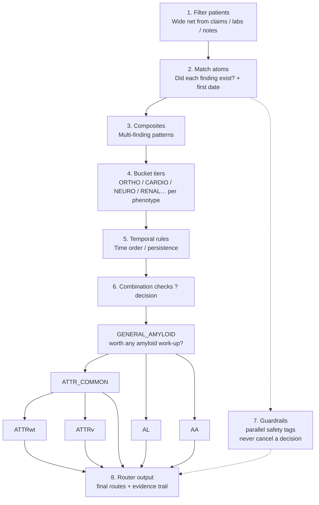

# ATTR V3 — Step-by-step patient flow

```mermaid
flowchart TB
  S1["1. Filter patients<br/>Wide net from claims / labs / notes"]
  S2["2. Match atoms<br/>Did each finding exist? + first date"]
  S3["3. Composites<br/>Multi-finding patterns"]
  S4["4. Bucket tiers<br/>ORTHO / CARDIO / NEURO / RENAL… per phenotype"]
  S5["5. Temporal rules<br/>Time order / persistence"]
  S6["6. Combination checks ? decision"]

  S1 --> S2 --> S3 --> S4 --> S5 --> S6

  GA["GENERAL_AMYLOID<br/>worth any amyloid work-up?"]

  S6 --> GA

  GA --> AC["ATTR_COMMON"]
  GA --> AL["AL"]
  GA --> AA["AA"]

  AC --> WT["ATTRwt"]
  AC --> AV["ATTRv"]

  GR["7. Guardrails<br/>parallel safety tags<br/>never cancel a decision"]
  S2 -.-> GR

  R["8. Router output<br/>final routes + evidence trail"]
  WT --> R
  AV --> R
  AL --> R
  AA --> R
  AC --> R
  GR -.-> R
```
